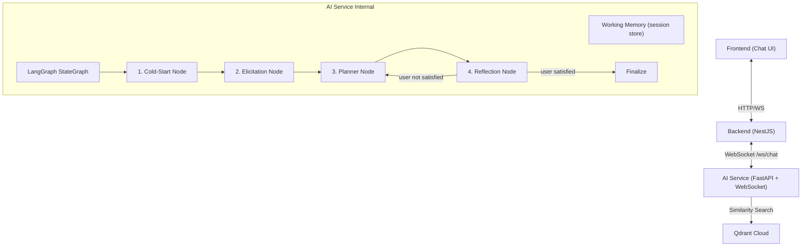
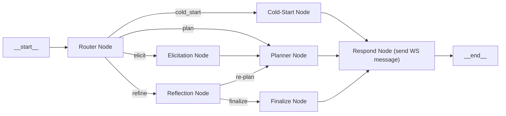

# AI Travel Planner Agent — Pipeline Workflow Design

Thiết kế hệ thống AI Agent cho `gialaitravel-ai-service-v2`, hoạt động như một Planner Agent kết nối Backend qua WebSocket, sử dụng LangGraph để điều khiển luồng 4 bước và Qdrant Cloud làm Vector DB.

## User Review Required

> [!IMPORTANT]
> Đây là thay đổi kiến trúc lớn, bao gồm:
> - Thay thế REST `/chat` endpoint hiện tại bằng **WebSocket** endpoint `/ws/chat`
> - Thiết lập hệ thống **Working Memory** (in-memory dict, key = `session_id`)
> - Xây dựng **LangGraph StateGraph** mới với 4 node chính + conditional edges
> - **Qdrant repository** phải dùng `gemini-embedding-2` (3072 chiều) bất kể `LLM_PROVIDER`

> [!WARNING]
> File `src/infrastructure/qdrant_repo.py` hiện tại dùng dynamic embedding model theo `LLM_PROVIDER`. Sẽ phải refactor lại để **luôn** dùng `GoogleGenerativeAIEmbeddings(model="models/gemini-embedding-2")` vì data trên Qdrant Cloud đã được index bằng model này.

---

## Tổng quan Kiến trúc Pipeline



---

## 1. WebSocket Protocol & Message Schema

### 1.1. Kết nối
```
ws://ai-service:8000/ws/chat?session_id=abc-123
```
Backend gửi `session_id` khi khởi tạo WebSocket. AI Service tạo/khôi phục Working Memory từ `session_id`.

### 1.2. Message từ Backend → AI Service (Input)

```json
{
  "type": "user_message",
  "session_id": "abc-123",
  "payload": {
    "message": "2 ngày 1 đêm",
    "chip_value": "2d1n"
  }
}
```

| Field | Type | Mô tả |
|-------|------|--------|
| `type` | `string` | Luôn là `"user_message"` |
| `session_id` | `string` | ID phiên (do Backend quản lý user auth) |
| `payload.message` | `string` | Text thô user nhập hoặc label chip đã chọn |
| `payload.chip_value` | `string \| null` | Giá trị chip nếu user chọn từ UI chips (vd: `"2d1n"`, `"couple"`, `"motorbike"`). `null` nếu user gõ tự do. |

### 1.3. Message từ AI Service → Backend (Output)

AI Service trả về nhiều loại message khác nhau tuỳ theo bước đang xử lý:

#### Type 1: `cold_start_question` — Hỏi ràng buộc cứng
```json
{
  "type": "cold_start_question",
  "step": "cold_start",
  "question_key": "duration",
  "agent_message": "Xin chào! Bạn đang lên kế hoạch khám phá Gia Lai — tuyệt lắm! Chuyến đi của bạn?",
  "ui_chips": [
    {"label": "2 ngày 1 đêm", "value": "2d1n"},
    {"label": "3 ngày 2 đêm", "value": "3d2n"},
    {"label": "4 ngày 3 đêm", "value": "4d3n"},
    {"label": "Dài hơn", "value": "custom"}
  ]
}
```

#### Type 2: `elicitation_question` — Khai thác vibe ngầm
```json
{
  "type": "elicitation_question",
  "step": "elicit",
  "agent_message": "Một câu cuối để mình hiểu gu của bạn — bạn hình dung ngày đầu tiên ở Gia Lai như thế nào?",
  "ui_chips": [
    {"label": "Dấn thân vào thiên nhiên, leo thác, trekking rừng nguyên sinh", "value": "adventure_nature"},
    {"label": "Thong thả dạo chùa, ngắm hồ, chụp ảnh nhẹ nhàng", "value": "relaxed_sightseeing"},
    {"label": "Khám phá văn hoá bản địa Jrai, thử ẩm thực đường phố", "value": "culture_food"},
    {"label": "Tự mô tả...", "value": "custom"}
  ],
  "allow_free_text": true
}
```

#### Type 3: `itinerary` — Lịch trình hoàn chỉnh
```json
{
  "type": "itinerary",
  "step": "plan",
  "agent_message": "Đây là lịch trình mình đã thiết kế cho bạn!",
  "itinerary": {
    "days": [
      {
        "day": 1,
        "title": "Khám phá trung tâm Pleiku",
        "total_km": 22,
        "activities": [
          {
            "time_slot": "08:00 - 10:00",
            "poi_id": "POI_001",
            "poi_name": "Biển Hồ Gia Lai",
            "lat": 14.040503,
            "lng": 108.000075,
            "duration_minutes": 120,
            "cost": 10000,
            "distance_from_prev_km": 7,
            "intensity_level": "low",
            "note": "Ngắm bình minh trên hồ, đạp xe quanh hồ"
          }
        ]
      }
    ],
    "total_cost": 120000,
    "total_km": 45
  },
  "ui_chips": [
    {"label": "Hài lòng, xác nhận lịch trình!", "value": "confirm"},
    {"label": "Cần điều chỉnh", "value": "refine"}
  ]
}
```

#### Type 4: `refinement_options` — Gợi ý chỉnh sửa
```json
{
  "type": "refinement_options",
  "step": "refine",
  "agent_message": "Mình hiểu rồi — chặng Pleiku → Thác Phú Cường hơi xa cho xe máy. Bạn muốn mình điều chỉnh theo hướng nào?",
  "ui_chips": [
    {"label": "Giữ Thác Phú Cường nhưng chuyển sang ngày 2", "value": "move_poi"},
    {"label": "Bỏ Thác Phú Cường, thay bằng điểm gần hơn", "value": "replace_poi"}
  ],
  "constraint_learned": "Không gộp Pleiku + Chư Sê trong cùng 1 ngày khi đi xe máy"
}
```

#### Type 5: `finalized` — Xác nhận hoàn tất
```json
{
  "type": "finalized",
  "step": "finalized",
  "agent_message": "Lịch trình đã được xác nhận! Chúc bạn có chuyến đi tuyệt vời ở Gia Lai!",
  "itinerary": { "..." }
}
```

---

## 2. Working Memory State

```python
class WorkingMemory:
    session_id: str
    current_step: str  # "cold_start" | "elicit" | "plan" | "refine" | "finalized"
    
    # Cold-start constraints
    duration: str | None         # "2d1n", "3d2n", "4d3n", "custom"
    group: str | None            # "solo", "couple", "group", "family"
    transport: str | None        # "motorbike", "car", "unknown"
    
    # Derived filters
    intensity_filter: list[str]  # ["low", "medium"] based on group + transport
    max_km_per_day: float        # 35km for motorbike, 80km for car
    
    # Elicitation
    vibe_query: str | None       # Embedded user description
    
    # Itinerary
    current_itinerary: dict | None
    
    # Constraints learned from reflection
    learned_constraints: list[str]  # e.g. ["Không gộp Pleiku + Chư Sê xe máy"]
    
    # Conversation history
    messages: list[dict]
```

### Step Detection Logic
```python
def detect_step(memory: WorkingMemory) -> str:
    if not all([memory.duration, memory.group, memory.transport]):
        return "cold_start"
    if not memory.vibe_query:
        return "elicit"
    if not memory.current_itinerary:
        return "plan"
    return "refine"  # has itinerary, waiting for feedback
```

---

## 3. LangGraph StateGraph Design



### Node Responsibilities

| Node | Mô tả |
|------|--------|
| **Router** | Đọc `WorkingMemory.current_step`, điều hướng tới node phù hợp |
| **Cold-Start** | Kiểm tra thiếu field nào (`duration`/`group`/`transport`), tạo câu hỏi + chips tương ứng. Cập nhật memory khi nhận answer. |
| **Elicitation** | Đặt câu hỏi vibe. Embed câu trả lời bằng `gemini-embedding-2` → lưu vào `vibe_query`. Tự động chuyển sang Planner. |
| **Planner** | Xây Qdrant `must_filter` từ memory → Query vibe_poi + logistics_poi → Deduplicate by `poi_id` → Haversine sort → LLM sinh itinerary structured JSON |
| **Reflection** | Nhận feedback, phân tích lỗi, lưu `learned_constraints`, đưa 2 lựa chọn. Nếu user confirm → Finalize. |
| **Finalize** | Gửi itinerary cuối cùng + message chúc mừng. |

---

## 4. Qdrant Query Strategy

### 4.1. Embedding Model (Cố định)
```python
# LUÔN dùng gemini-embedding-2 cho query, bất kể LLM_PROVIDER
EMBEDDING_MODEL = "models/gemini-embedding-2"
VECTOR_SIZE = 3072
```

Thêm vào `.env.example`:
```env
EMBEDDING_MODEL="models/gemini-embedding-2"
```

### 4.2. Filter Construction từ Working Memory
```python
def build_qdrant_filter(memory: WorkingMemory, aspect: str) -> dict:
    must = [
        {"key": "aspect", "match": {"value": aspect}},  # "vibe_poi" or "logistics_poi"
        {"key": "intensity_level", "match": {"any": memory.intensity_filter}},
        {"key": "transport_compatibility", "match": {"any": [memory.transport]}},
        {"key": "suitable_for", "match": {"any": [memory.group]}},
    ]
    return {"must": must}
```

### 4.3. Dual-Aspect Search
```python
# Step 1: Search vibe_poi với vibe_query
vibe_results = qdrant.search(query_vector=embed(vibe_query), filter=build_filter("vibe_poi"), limit=10)

# Step 2: Search logistics_poi với vibe_query (cross-aspect)
logistics_results = qdrant.search(query_vector=embed(vibe_query), filter=build_filter("logistics_poi"), limit=10)

# Step 3: Merge & Deduplicate by poi_id
merged = deduplicate_by_poi_id(vibe_results + logistics_results)
```

### 4.4. Distance Validation (Haversine)
```python
import math

def haversine_km(lat1, lng1, lat2, lng2) -> float:
    R = 6371
    dlat = math.radians(lat2 - lat1)
    dlng = math.radians(lng2 - lng1)
    a = math.sin(dlat/2)**2 + math.cos(math.radians(lat1)) * math.cos(math.radians(lat2)) * math.sin(dlng/2)**2
    return R * 2 * math.asin(math.sqrt(a))

def road_distance_km(lat1, lng1, lat2, lng2) -> float:
    return haversine_km(lat1, lng1, lat2, lng2) * 1.4  # Mountain road factor
```

---

## 5. Proposed File Changes

### Core & Config
#### [MODIFY] [config.py](file:///d:/GIT/gialaitravel-ai-service-v2/src/core/config.py)
- Thêm `EMBEDDING_MODEL`, `QDRANT_COLLECTION_NAME`, `COLLECTION_NAME`

#### [MODIFY] [.env.example](file:///d:/GIT/gialaitravel-ai-service-v2/.env.example)
- Thêm `EMBEDDING_MODEL`, `QDRANT_COLLECTION_NAME`

---

### Domain Layer
#### [NEW] `src/domain/working_memory.py`
- Dataclass `WorkingMemory` (session state)

#### [NEW] `src/domain/itinerary.py`
- Dataclass `Itinerary`, `DayPlan`, `Activity`

---

### Application Layer (Graph)
#### [MODIFY] [state.py](file:///d:/GIT/gialaitravel-ai-service-v2/src/application/graph/state.py)
- Thêm WorkingMemory vào AgentState

#### [DELETE] `src/application/graph/workflow.py` (thay bằng file mới)

#### [NEW] `src/application/graph/nodes/router.py`
#### [NEW] `src/application/graph/nodes/cold_start.py`
#### [NEW] `src/application/graph/nodes/elicitation.py`
#### [NEW] `src/application/graph/nodes/planner.py`
#### [NEW] `src/application/graph/nodes/reflection.py`
#### [NEW] `src/application/graph/nodes/finalize.py`
#### [NEW] `src/application/graph/pipeline.py`
- Tổng hợp StateGraph, kết nối các nodes, conditional edges

#### [NEW] `src/application/services/distance.py`
- Haversine calculation utility

---

### Infrastructure Layer
#### [MODIFY] [qdrant_repo.py](file:///d:/GIT/gialaitravel-ai-service-v2/src/infrastructure/qdrant_repo.py)
- Fix embedding model → luôn `gemini-embedding-2` (3072 chiều)
- Thêm `filtered_search(query, filter, limit)` method
- Collection name từ config

#### [NEW] `src/infrastructure/session_store.py`
- In-memory dict lưu `WorkingMemory` theo `session_id`

---

### Presentation Layer
#### [DELETE] `src/presentation/api/chat.py` (thay bằng WebSocket)
#### [DELETE] `src/presentation/schemas_chat.py`

#### [NEW] `src/presentation/schemas_ws.py`
- Pydantic models cho tất cả WebSocket message types (input/output)

#### [NEW] `src/presentation/ws/chat.py`
- WebSocket endpoint `/ws/chat`
- Connection manager, message routing

#### [MODIFY] [main.py](file:///d:/GIT/gialaitravel-ai-service-v2/src/main.py)
- Thay `chat.router` bằng WebSocket router

#### [MODIFY] [AGENTS.md](file:///d:/GIT/gialaitravel-ai-service-v2/AGENTS.md)
- Cập nhật kiến trúc, thêm mô tả pipeline

---

## 6. Verification Plan

### Automated Tests
- Unit test cho `haversine_km`
- Unit test cho `build_qdrant_filter`
- Unit test cho `detect_step` logic
- Integration test: Gửi WebSocket message giả lập → kiểm tra output type đúng step

### Manual Verification
- Kết nối WebSocket bằng tool (Postman/wscat)
- Gửi lần lượt: chip duration → chip group → chip transport → vibe text
- Kiểm tra itinerary output có đúng format JSON, POI hợp lệ, khoảng cách đúng ràng buộc
